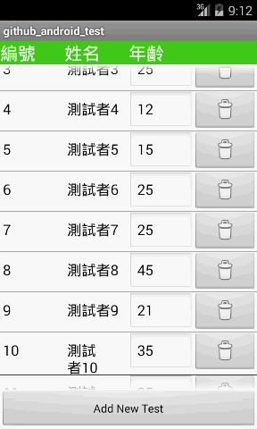
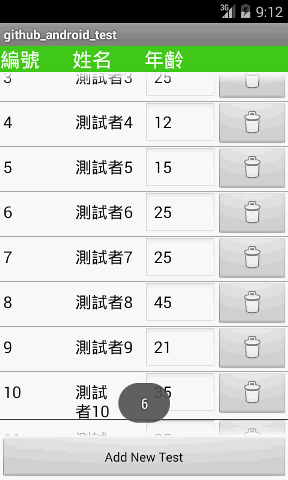

介紹
============

以json資料直接呈現至android畫面上

&nbsp;&nbsp;

使用
=====

1.在eclipse裡以Existing Android Code Into Workspace將下載的檔案匯入

2.在您指定的layout中填上xml.

```xml
	<com.javis.android.widget.jsonTableLayout
        android:id="@+id/jsonTablelayout"
        android:layout_width="match_parent"
        android:layout_height="match_parent" >

    </com.javis.android.widget.jsonTableLayout>
```

3.在java中需初始化欄位結構.

```java
	ArrayList<HashMap<String, String>> columnDefs = new ArrayList<HashMap<String, String>>();
	columnDefs.add(new HashMap<String, String>() {
		{
			put("field", "id");
			put("displayName", "編號");
		}
	});
	columnDefs.add(new HashMap<String, String>() {
		{
			put("field", "name");
			put("displayName", "姓名");
		}
	});
	columnDefs.add(new HashMap<String, String>() {
		{
			put("field", "age");
			put("displayName", "年齡");
			put("type", "editText");
		}
	});
```

4.以findViewById找畫面上的id，並初始化jTb.

```java
	jsonTableLayout jTb = (jsonTableLayout) findViewById(R.id.jsonTablelayout);
	jTb.init(columnDefs);
```

5.將json資料set到jTb裡

```java
	JSONArray arr = new JSONArray(
					"[{'id':1,'name':'測試者1','age':25},{'id':2,'name':'測試者2','age':11}"
							+ ",{'id':3,'name':'測試者3','age':25},{'id':4,'name':'測試者4','age':12}"
							+ ",{'id':5,'name':'測試者5','age':15},{'id':6,'name':'測試者6','age':25}"
							+ ",{'id':7,'name':'測試者7','age':25},{'id':8,'name':'測試者8','age':45}"
							+ ",{'id':9,'name':'測試者9','age':21},{'id':10,'name':'測試者10','age':35}"
							+ ",{'id':11,'name':'測試者11','age':25},{'id':12,'name':'測試者12','age':25}"
							+ ",{'id':13,'name':'測試者13','age':25},{'id':14,'name':'測試者14','age':13}"
							+ ",{'id':15,'name':'測試者15','age':17},{'id':16,'name':'測試者16','age':25}]");
	jTb.setData(arr);
```

6.啟動jTb

```java
	jTb.run();
```

API
=====

設定屬性

setHeaderBgColor 設定標頭背景顏色

setHeaderTextSize 設定標頭文字大小

setHeaderTextColor 設定標頭文字顏色

setBodyTextSize 設定列文字大小

setBodyTextColor 設定列文字顏色

setBodyItemTouchDownColor 設定列按下顏色

方法

init(ArrayList<HashMap<String,String>> columnDefs) 初始化jsonTableLayout，並且傳入欄位資訊參數

setData(JSONArray jObjArr) set json資料

getData() 取得目前JSONArray

getData(int postion) 取得某列JSONObject

run() 啟動jsonTableLayout

addItem(JSONObject tag) 增加一列資料在最底

removeItem(int idx) 刪除指定列

clear() 刪除全部json資料

getScrollViewX() 取得目前view的x軸

getScrollViewY() 取得目前view的y軸

setScrollViewXY(int x,int y) 設定目前view跳至指定的x,y位置

setOnTouchListener(OnTouchListener mOnTouchListener) 設定列的Touch事件

setDeleteOnTouchListener(deleteOnTouchListener mdeleteOnTouchListener) 設定監聽後，內部啟用刪除鈕在畫面上，供刪除使用
